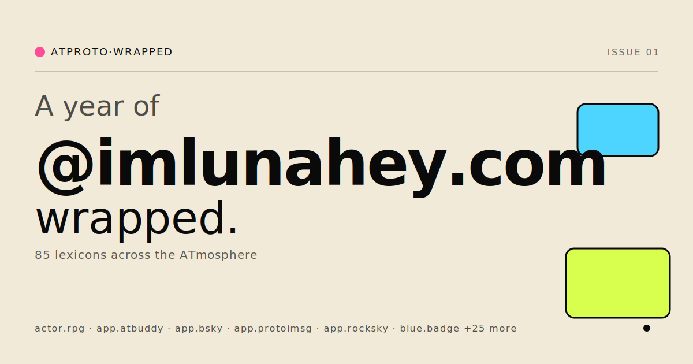

<p align="center">
  
</p>

# ATproto Wrapped

A Spotify-Wrapped-style retrospective for any [ATproto](https://atproto.com)
account. Drop a Bluesky handle, the app fetches your entire repo CAR straight
from your PDS, parses every block locally, and turns the year's records —
posts, likes, scrobbles, oekaki, blog entries, the long-tail stuff — into a
magazine-style spread.

Sharing a wrap produces a `/@<handle>` URL that unfurls with a server-rendered
OG card. The card above is exactly what would be served at
`/og/imlunahey.com?format=svg`.

## Stack

- **[TanStack Start](https://tanstack.com/start)** — file-based routes,
  server functions, SSR for the page shell + per-route OG meta tags.
- **[React](https://react.dev) + [TanStack Query](https://tanstack.com/query)** —
  client-side CAR fetching and progress, with IndexedDB caching for repeat visits.
- **[Tailwind CSS](https://tailwindcss.com)** — utility styling, custom theme
  in [`src/index.css`](src/index.css).
- **[@ipld/car](https://github.com/ipld/js-car) + [@ipld/dag-cbor](https://github.com/ipld/js-dag-cbor) + [multiformats](https://github.com/multiformats/js-multiformats)** —
  CAR parsing, MST walking, CID decoding. See [`src/lib/atproto.ts`](src/lib/atproto.ts).
- **[@resvg/resvg-wasm](https://github.com/yisibl/resvg-js)** — server-side
  SVG → PNG rasterization for OG cards.
- **[Cloudflare Workers](https://workers.cloudflare.com)** via
  [`@cloudflare/vite-plugin`](https://developers.cloudflare.com/workers/vite-plugin/) —
  deployment target. The Worker also serves cached OG PNGs via the
  [Cache API](https://developers.cloudflare.com/workers/runtime-apis/cache/).

## Develop

```bash
npm install
npm run dev          # vite dev — http://localhost:5173
```

## Build & deploy

```bash
npm run build        # vite build (client + server bundles into dist/)
npm run deploy       # vite build + wrangler deploy
```

First deploy will prompt for Cloudflare auth via wrangler.

## Project layout

```
src/
├── routes/
│   ├── __root.tsx         # html shell, fonts, Tailwind, head/scripts
│   ├── index.tsx          # landing page
│   ├── @{$handle}.tsx     # wrapped page — head() injects OG/twitter meta
│   └── og/$handle.ts      # server route — generates + caches OG PNG/SVG
├── components/
│   ├── Landing.tsx        # marketing/landing
│   ├── Wrapped.tsx        # orchestrates the whole magazine spread
│   ├── wrapped/           # nav, intro, big slides, bento, tail, footer
│   └── featured/          # one file per service (bluesky, music, grain, …)
├── lib/
│   ├── atproto.ts         # PDS discovery, CAR fetch, MST parse
│   ├── featured.ts        # per-service highlight extractors
│   ├── labels.ts          # nsid → human-friendly descriptors
│   ├── ogPoster.ts        # SVG builder for OG cards
│   ├── shareUrl.ts        # navigator.share with clipboard fallback
│   └── format.ts          # shortenDid, relativeDate, initial
├── hooks/useInView.ts     # IntersectionObserver hook for scroll-in animations
└── router.tsx             # createRouter + QueryClient
```

## OG image endpoint

`GET /og/<handle>` returns a 1200×630 PNG. Add `?format=svg` to get the raw SVG
(useful for design tweaks or, like the top of this README, including in docs).

Fonts (Bricolage Grotesque, Instrument Serif Italic, JetBrains Mono Medium)
are fetched from jsdelivr once per worker isolate. Rendered PNGs are cached in
Cloudflare's Cache API for 24h, keyed by full request URL — change the SVG
builder and bust the cache by deploying.

The poster intentionally uses cheap data (`com.atproto.repo.describeRepo` for
the collection list, not the full CAR) so OG crawlers don't trigger an
expensive CAR fetch + parse on every cold request. The richer in-page wrap
still does the full client-side parse.

## How the wrap is built

1. **Resolve handle** via the Bluesky AppView (`resolveHandle`).
2. **Discover PDS** by fetching the DID document from `plc.directory` (or
   `did:web` host) and reading the `#atproto_pds` service entry.
3. **Stream the CAR file** from `com.atproto.sync.getRepo` (with a download
   progress bar).
4. **Parse blocks** in two passes: walk the MST to map block CIDs to record
   keys, then decode each record block with dag-cbor.
5. **Bucket by collection** and run per-service highlight extractors
   ([`src/lib/featured.ts`](src/lib/featured.ts)) for the ~20 spotlight services.
6. **Render** the magazine spread top-down: intro → Bluesky → top-N
   collections → service spotlights → bento of mid-shelf → long-tail list.

Everything except OG rendering happens in the browser. The CAR is cached in
IndexedDB for 6 hours so reloading the same handle is instant.

## License

MIT.
